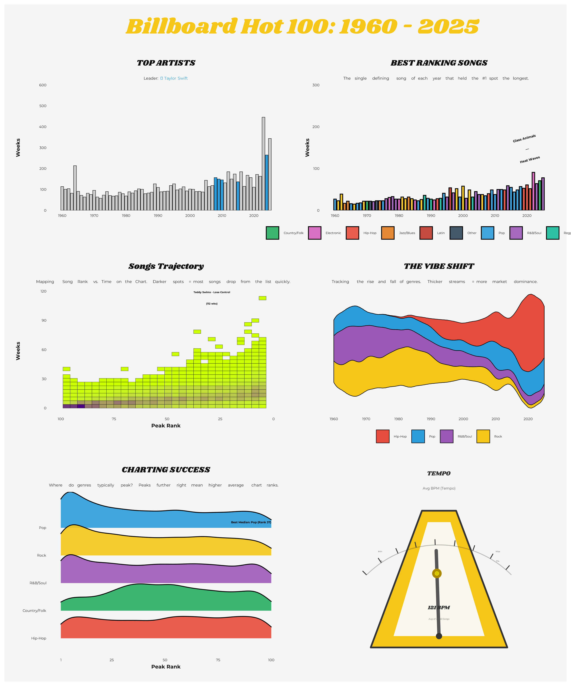
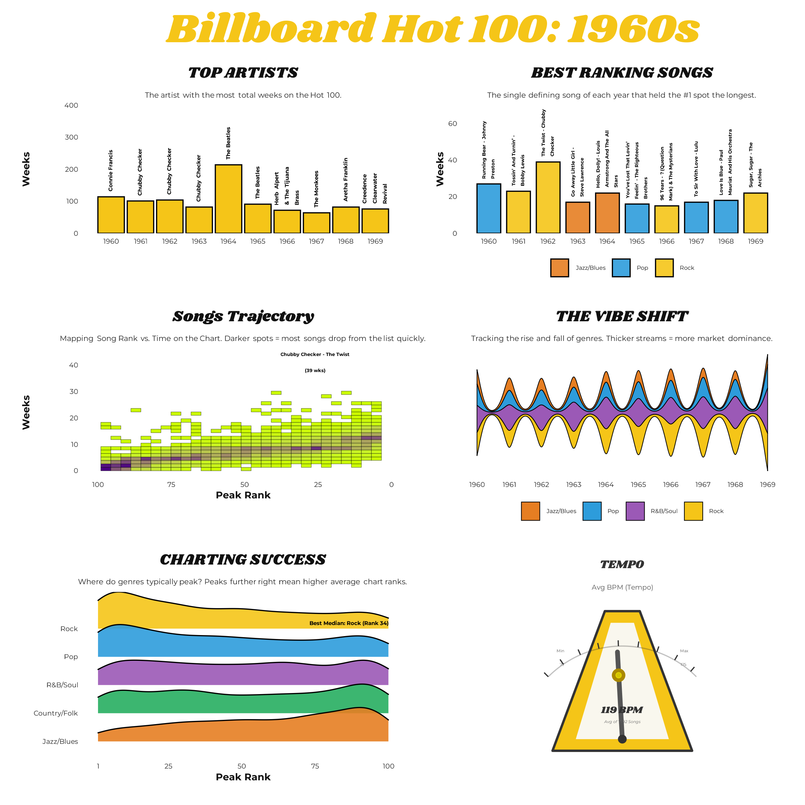
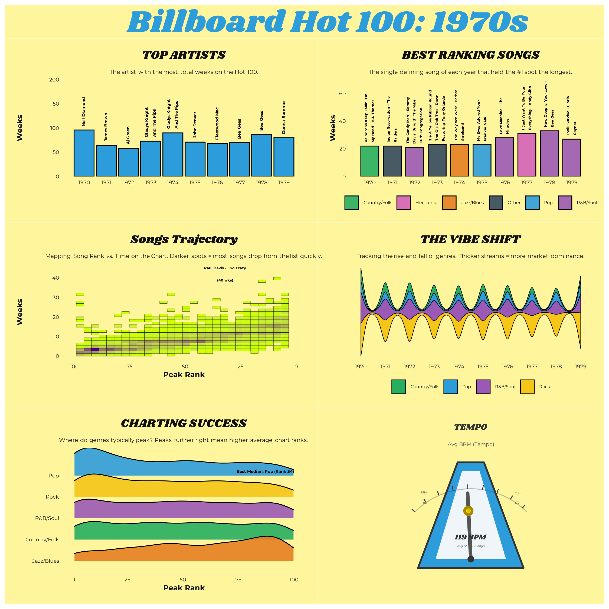
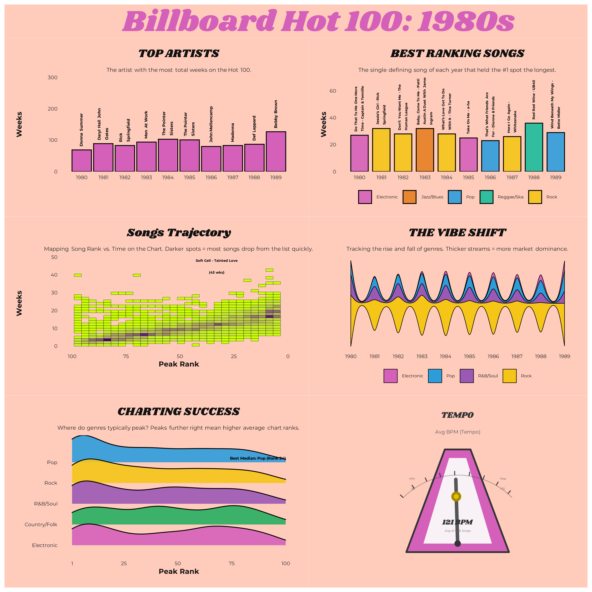
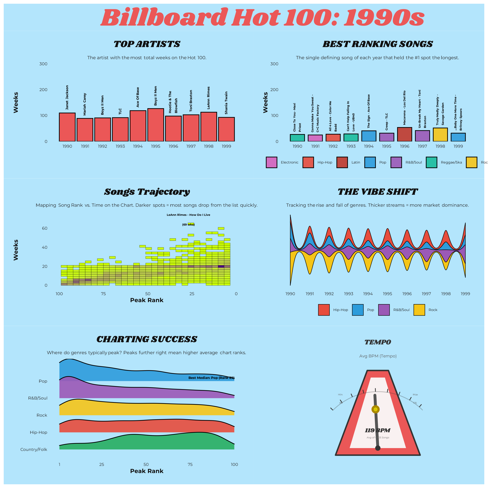
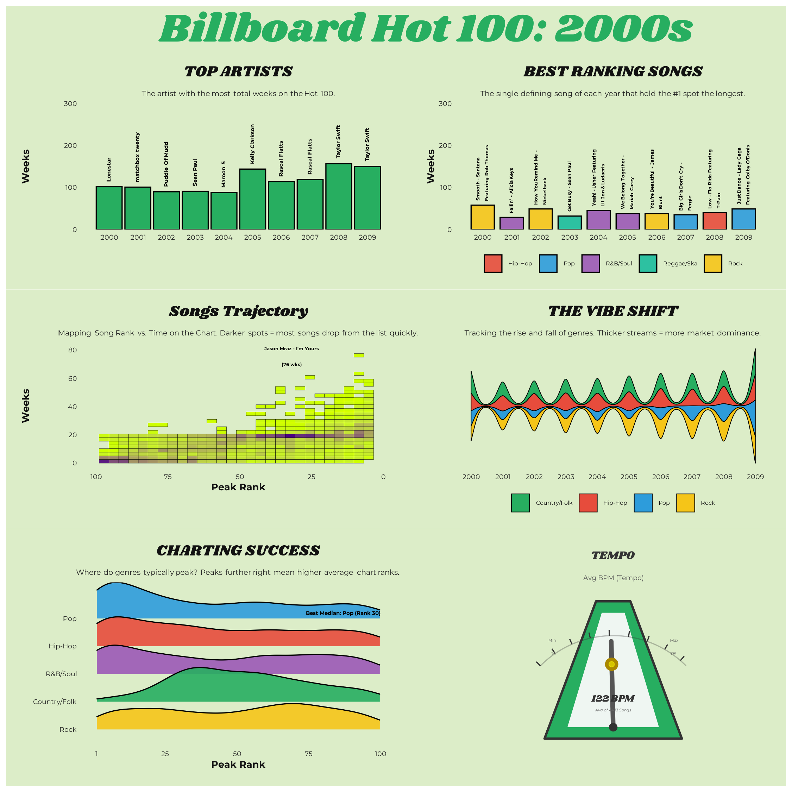
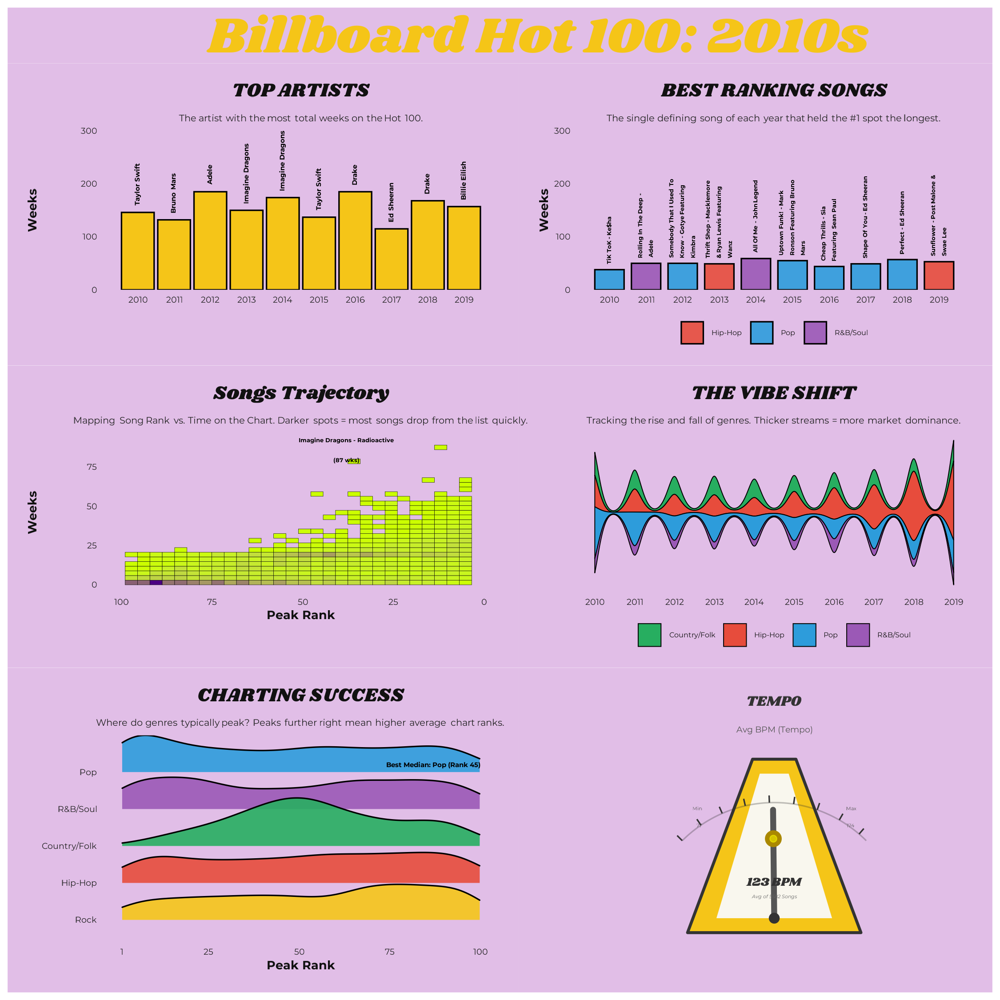
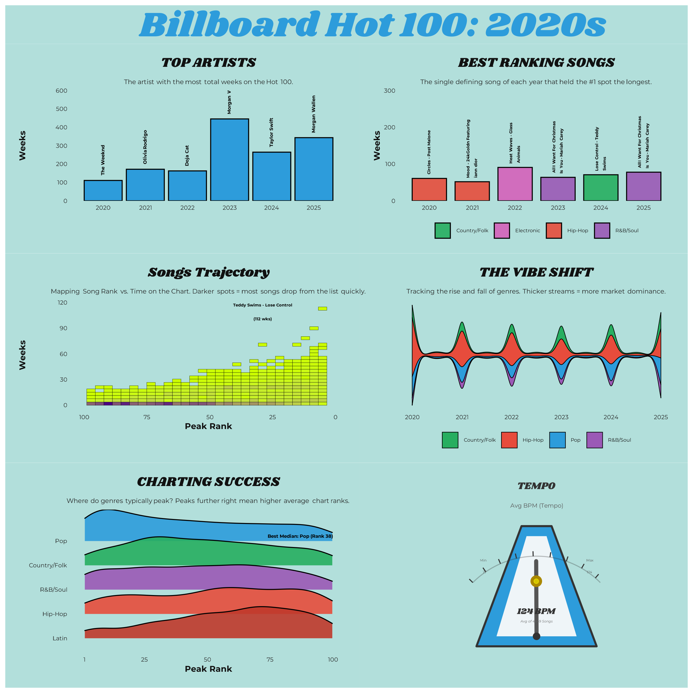

# Evolution-of-Mainstream-Music-Billboard-Hot-100
Tracking the evolution of mainstream music through data visualization (1960-2025).
The data is collected by scraping Billboard Hot 100 history and enriched with MusicBrainz and TheAudioDB APIs. 

## Table of Contents
* [The Vinyl Dashboard: Longest-Running Hits](#-the-vinyl-dashboard-longest-running-hits)
* [Billboard Hot 100 Timeline Infographic](#-billboard-hot-100-timeline-infographic)
* [Data Collection & Sources](#️-data-collection--sources)

---

## The Vinyl Dashboard: Longest-Running Hits

A vinyl-styled visualization showing the artists with the highest "longevity" on Billboard Top 100; longevity is defined by total amount of weeks accumulated while the track is on the list.
Time is mapped around the vinyl's circumference, while the vinyl grooves serve as a scale for longevity; the further a bar extends outward, the longer that song stayed on the Hot 100.

  

---

## 📊 Billboard Hot 100 Timeline Infographic

The following visualizations break down 65 years of musical data into specific eras. Each dashboard analyzes the following metrics:

* **Top Artist:** The act maintaining the highest cumulative weeks on the Billboard Hot 100 chart per year.
* **Top Songs:** The longest-running #1 hit for every single year in the dataset. 
* **Chart Velocity:** A density map showing the relationship between a song's Peak Rank (1-100) and its total weeks on chart. Hotter areas (Violet) indicate where most songs cluster.
* **Genres Wave:** A streamgraph showing the "Volume" or market share of the top 4 genres over time. Thickness indicates higher popularity in the mainstream.
* **Genre Longevity:** A ridgeplot showing the distribution of "staying power." It tracks how many weeks songs in a specific genre stay on the chart, identifying which genres produce "long-tail" hits versus "flash-in-the-pan" successes.
* **Tempo Analysis:** A dynamic metronome showing the Average BPM (Beats Per Minute) for the era, including the typical range (5th to 95th percentile).

### 🏆 All-Time Master Dashboard (1960-2025)

  

### 📅 Explore by Decade
*Click a decade below to expand the high-resolution dashboard without leaving the page.*

| 1960s | 1970s | 1980s | 1990s |
| :---: | :---: | :---: | :---: |
| 

🔍 View 60s
 
 | 

🔍 View 70s
 
 | 

🔍 View 80s
 
 | 

🔍 View 90s
 
 |

| 2000s | 2010s | 2020s |
| :---: | :---: | :---: |
| 

🔍 View 00s
 
 | 

🔍 View 10s
 
 | 

🔍 View 20s
 
 |

---

## ⚙️ Data Collection & Sources

This project uses a multi-source data pipeline, integrating core historical chart data with dual API metadata enrichment. 

1. **Billboard Hot 100 History (Base Data)**
   * **Source:** [utdata/rwd-billboard-data](https://github.com/utdata/rwd-billboard-data)
   * Contains weekly performance from 1960 to present.

2. **MusicBrainz API (Core Metadata)**
   * Fetches demographics, band relations (solo vs group), and community-voted genre tags.

3. **TheAudioDB API (Supplemental Enrichment)**
   * Fallback for missing genre metadata and qualitative "Mood" attributes.
